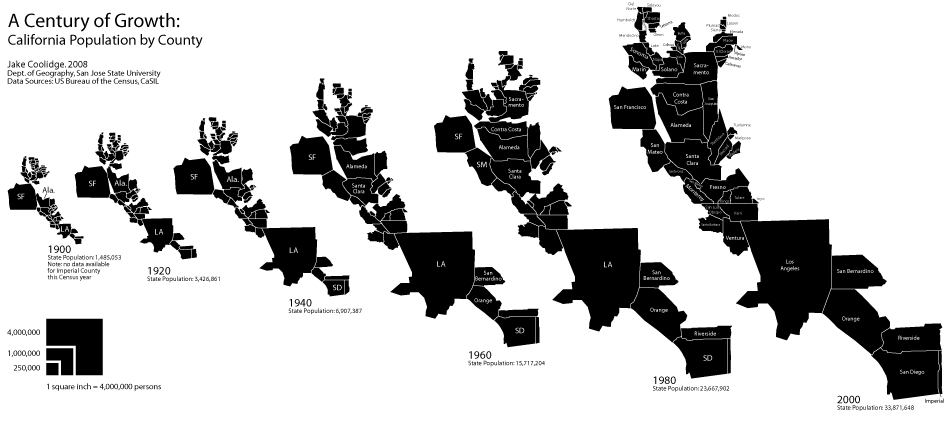
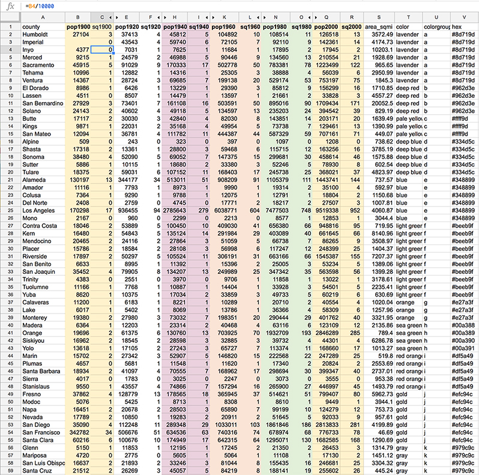
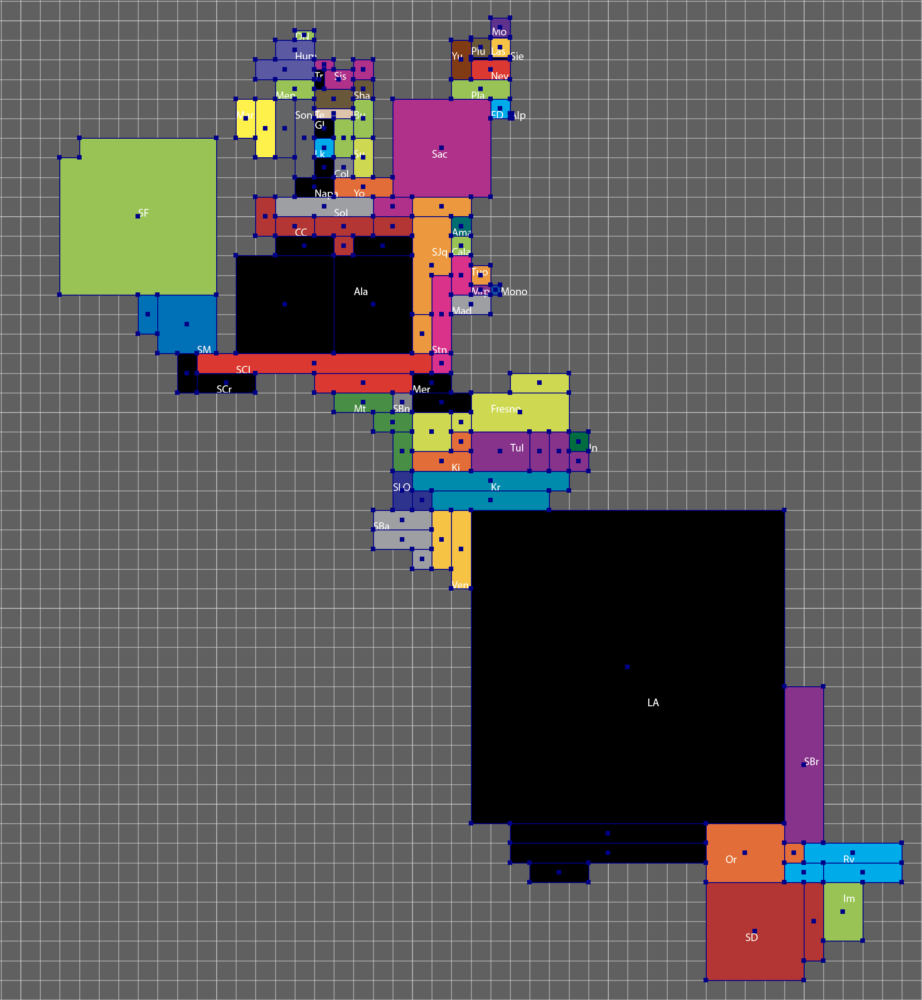
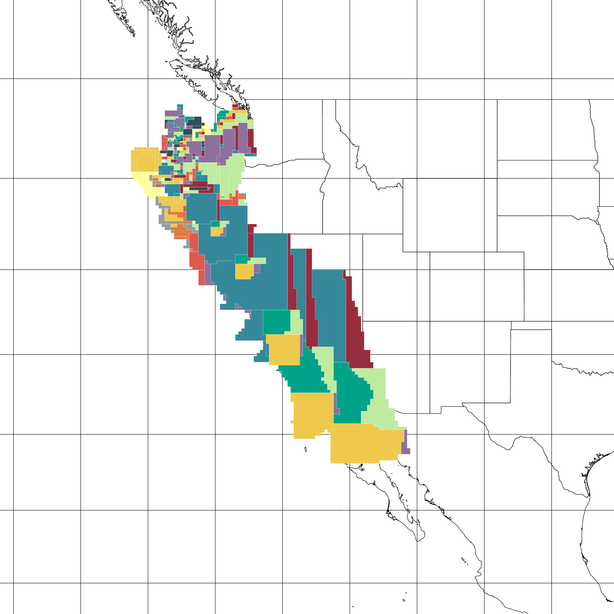
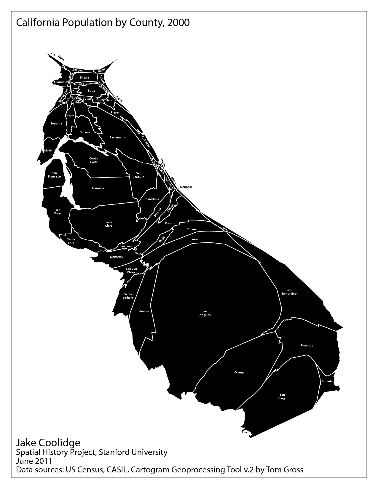

# A Century of Growth

* [Project Overview](#project-overview)
* [Cartogram Production Process](#cartogram-process)

<h2 id="project-overview">Project Overview</h2>

Through a series of cartograms, "A Century of Growth" charts the growth of population in California in the twentieth century, and highlights the uneven patterns of this growth across its various counties.

The driver for this map has always been is to use the unique characteristics of the cartogram to help the user visualize the growth of California over time. Only the most populous counties were discernible, with limited labeling, in a previous, static version of the map, shown below. An animated version of the cartogram series, built using Adobe Flash (and therefore essentially lost to history), allowed the user to follow the transitions dynamically as it looped through the 20-year intervals, GIF-like. But the map lacked interactivity, greatly limiting its utility. By contrast, this new version allows users to scroll backward and forward through the intervals at their own pace and provides mouseover affordances at each stage, making the data much more accessible and reducing users' reliance on a legend to retrieve populations for individual counties.

<h2 id="cartogram-process">Cartogram Production Process</h2>

I start with a table of all county populations, by census year. I add columns to the table where I divide each population by 10,000 and round to the nearest integer. This gives me the number 0.1 x 0.1 inch squares that I will use to build each county. For example, in 1980, Calaveras County had 20,710 inhabitants, so that county's shape will be built out of 2 squares, and in that same year Fresno County had 514,621, for a total of 51 squares. In limited cases, I draw squares and rectangles that are smaller than 0.1 x 0.1 in. In 1900, Inyo County had 4,377 inhabitants, and my table produces a result of 0 squares. Rather than round up to 1 square, I create a square that is 0.05 x 0.1 in, or roughly 5,000 persons according to my scale.

I use Illustrator as my vector graphics software (this is important since I use the MAPublisher plugin later in the process). I set up the document's grid for 0.1 inch increments, enable it, and then select Snap to Grid. I build larger counties out of smaller groups of "blocks", almost Tetris-style, so I can shape and fit the counties to match, as much as possible, their original shapes and the topological relationships amongst the various counties (for example, Santa Barbara County is vaguely rectangular, shares its eastern border with Ventura County, its northern border with San Luis Obispo County, and its northeastern corner meets the southwestern corner of Kern County). I refer to a normal map of California counties continuously during this phase. It's impossible not to incur some shearing and discontinuity in the process. Mono County, with its 1980 population of 8,577, would be stretched so thin as to be rendered practically invisible. I discuss a contemporary alternative of cartogram production and why I've opted for this "counting squares" method as an [addendum](#addendum-cartogram-production-alternatives) below.

Once the "blocks" have coalesced into a final configuration, I trace each county's outline in a new layer. I copy and paste the traced shapes into an Illustrator document with an active MAPublisher map view, but before I do that, I must set up this MAPublisher-enabled document. (Learn more about this geospatial plugin for Illustrator by visiting [the software producer's website.](https://www.avenza.com/mapublisher/))

First, I take some [Natural Earth](http://www.naturalearthdata.com/) reference data and reproject it to EPSG 3857 (Web Mercator) in QGIS. I then load this data into an Illustrator document using MAPublisher. MAPublisher loads the data in a new map view using the Web Mercator projection. I then create new, blank map layers in the map view to house my cartogram shapes. I paste the shapes made earlier into these layers. Where I place them on the map, in other words, in relation to the Natural Earth reference data, is essentially arbitrary. The cartogram shapes are not intended to be viewed with geographic features in the Web Mercator projection; this technique mainly makes use of Leaflet as a GeoJSON delivery mechanism. I've selected the west coast of the United States, generally, as the "geographic" location of the cartogram artwork. I've also "anchored" the visualization on the city and county of San Francisco, due to its early role as the population center of the state in 1900. With the cartogram in place, I assign to each shape the name of the county as an attribute. I can then join values from my population table to the shapes, using the county name as the common join field. I export the cartogram map layers as shapefiles from MAPublisher. MAPublisher assigns the Web Mercator projection to the shapes upon export.

I return to QGIS and enable 'on the fly' CRS transformation, setting the project CRS to EPSG 4326 (WGS 84). I then load the shapefiles made in the previous step, and save each layer as GeoJSON, using the project CRS (WGS 84), and setting the coordinate precision to 4. The resulting GeoJSON files are ready to use in Leaflet. Thanks to the WGS 84 CRS, the GeoJSON coordinates are decimal degrees, but the geometries were initially established in Web Mercator, meaning they will render in Leaflet with the conformal projection Leaflet uses (Web Mercator) as I intended, without angular distortion. (In other words, squares remain squares throughout.)

<h2>Legend Inset Map</h2>

I employ the same method described above to create the simple squares for the legend inset. In this case, the squares are centered on 0&deg; latitude, 0&deg; longitude. Since they were created at the same graphic scale as the cartogram artwork, and the zoom level of the inset map is tied to the zoom level of the main map, the inset functions as a legend that dynamically resizes as the zoom level of the cartograms is adjusted.

<h2 id="addendum-cartogram-production-alternatives">Addendum: Cartogram Production Alternatives</h2>
In the last decade, the Cartogram Geoprocessing tool, created by Tom Gross and available for ArcGIS Desktop, has automated the cartogram creation process. It makes use of a method first published by physicists/computational scientists Michael T. Gastner  and M.E.J. Newman in 2004, the ["diffusion-based method for producing density-equalizing maps."](http://www.pnas.org/content/101/20/7499), which adapts algorithms developed in the materials sciences to warp the size of shapes while maintaining topological relationships. [Kenneth Field has noted](https://mapdesign.icaci.org/2014/12/mapcarte-349365-density-equalizing-cartogram-by-michael-gastner-and-mark-newman-2004/) that their breakthrough represents "the holy grail" in cartogram production, solving many of the problems of topology and continuity that hindered earlier efforts. The result are maps with a distinct aesthetic akin to inflated and deflated balloons, or other decidedly organic analogies. A map I made using Gross's tool depicting California's population in 2000 makes the state look like a very well-fed slug. Interestingly, the "slug's antennae" of Del Norte and Modoc Counties, in the north of the state, also manifest themselves in a less organic way in my cartogram.

Of course, I am not making use of the affordances of Gross's tool in this cartogram series. Aside from the strange (if mathematically precise) aesthetic, I'm also interested in the idea of recovering data from the visualization; in other words, a user can visually compare the shapes to the simple legend and "recover" approximate values from the visualization. In some ways this was more straight-forward in the era of printed maps, where a user could be invited to use a ruler, for example, to measure distances from the center point of a equidistant projection map, though a determined user could print a screencapture of my cartogram for a similar purpose. As graduated symbols, the relative sizes of squares are considerably easy for users to compare, even easier than graduated circles. My cartograms are built with the square as the atomic unit, bolstering the legibility of the quantities while simultaneously simplifying and abstracting the resulting shapes away from their original mapped appearance. It's a trade-off, but I happen to be a fan of the older, human-produced cartogram production methods, despite their topological limitations.
